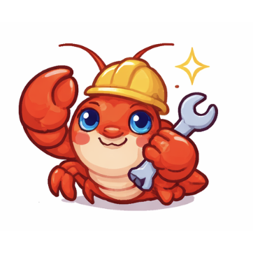

<p align="center">
  
</p>

<p align="center">
  <a href="./README.zh-CN.md">
    
  </a>
</p>

# ClawKeep

ClawKeep is a native macOS menu bar app for keeping `openclaw-gateway` alive.
It bundles a SwiftUI control surface with a local Go daemon, watches the gateway process and TCP health, sends alerts, and can hand recovery work to Claude Code, Codex, or a custom CLI command.

## For Users

### What You Get

- A menu bar status app for `openclaw-gateway`
- Quick actions for restart, maintenance pause, repair, reset, and update checks
- A settings window for monitor, repair agent, notifications, and logs
- Feishu and Bark notifications
- Automatic daily update checks for unsigned GitHub Releases

### Download And Install

Download the latest build from:

- [Latest Release](https://github.com/CJL-Labs/ClawKeep/releases/latest)

After downloading the zip:

1. Unzip it.
2. Open `ClawKeep.app` once from the extracted folder.
3. If macOS blocks it because the app is unsigned, go to `System Settings -> Privacy & Security` and allow it to open.
4. After the first successful open, move `ClawKeep.app` into `Applications` or `~/Applications`.

`~/Applications/ClawKeep.app` is the better target for this project because unsigned auto-update works more reliably in a user-writable directory.

### How To Use It

1. Launch ClawKeep. It opens the settings window on first start and also lives in the macOS menu bar.
2. In `Monitor`, confirm the gateway port and timeout settings for your local `openclaw-gateway`.
3. In `Repair Agent`, choose Claude Code, Codex, or a custom command as the preferred repair tool.
4. In `Notifications`, paste your Feishu webhook or Bark push URL and test delivery.
5. In `Logs`, list the log files or glob paths that should be included when ClawKeep prepares crash context.
6. Use the menu bar popup for day-to-day operations like restarting the gateway, pausing detection for maintenance, forcing a repair, or checking for updates.

### How It Works

- ClawKeep watches the gateway process and also probes the local TCP port.
- If the gateway exits unexpectedly, ClawKeep collects context and tries the configured repair tool.
- If one repair agent fails or times out, ClawKeep can continue with the next available option.
- If you are doing a planned restart or upgrade, use the maintenance pause so it is not treated as a crash.
- The app checks GitHub Releases for updates once per day, and you can also check manually from the menu bar or settings window.

### Supported User-Facing Features

- Watches `openclaw-gateway`
- Probes `127.0.0.1:<port>` to confirm service health
- Applies a grace window for planned restarts and upgrades
- Supports a maintenance pause from the UI
- Lets you manually reset monitoring after repair attempts are exhausted
- Auto-detects installed `claude` and `codex` CLIs
- Lets you choose a preferred repair agent
- Supports a custom repair command with custom args and working directory
- Uses a configurable repair prompt template
- Falls back to other configured agents when one fails or times out
- Verifies recovery after a repair attempt succeeds
- Feishu webhook notifications
- Bark push notifications
- Configurable events:
  - `crash`
  - `repair_start`
  - `repair_success`
  - `repair_fail`
  - `agent_timeout`

### Updates

- Manual update checks from the menu bar popup
- Manual update checks from the settings window
- One automatic update check per day
- Downloads unsigned release zips from GitHub Releases
- Replaces the current app through an external installer helper and relaunches

## For Developers

### Architecture

ClawKeep ships as a macOS app bundle that includes:

- `ClawKeep`, the SwiftUI app that owns the menu bar UI and settings window
- `keepd`, the local Go daemon that handles monitoring, repair orchestration, config loading, notifications, and IPC

The app talks to `keepd` over a local Unix domain socket using JSON IPC.

```text
app/       SwiftUI macOS app
keepd/     Go daemon
scripts/   build, packaging, dev-run, and update helper scripts
assets/    branding assets
.github/   GitHub Actions workflow
```

### Requirements

- macOS 15+
- Go
- Xcode / `xcodebuild`
- `xcodegen` if you want to regenerate the Xcode project from `app/project.yml`

### Local Development

Run the full local dev flow:

```bash
./scripts/dev-run.sh
```

Build an unsigned debug package:

```bash
./scripts/package-local.sh
```

Build an unsigned release package:

```bash
./scripts/package.sh
```

Outputs:

- `build/Build/Products/<Configuration>/ClawKeep.app`
- `dist/ClawKeep-macos-<Configuration>-unsigned.zip`

### Configuration

ClawKeep stores its config in:

```text
~/.claw-keep/config.toml
```

The current config surface includes:

- Gateway host, port, PID file, probe timeout, and exit grace period
- Max repair attempts
- Log paths to include in crash context
- Preferred repair agent and custom command settings
- Repair prompt template
- Feishu and Bark notification settings
- Daemon log directory, level, and retention

See [`config.example.toml`](./config.example.toml) for the shipped example.

### Release Flow

The repository includes a GitHub Actions workflow for unsigned builds.

On pushes, pull requests, and manual workflow runs:

- Build the macOS app
- Package an unsigned zip
- Upload workflow artifacts

On version tags:

- Create a GitHub Release
- Upload the tagged zip
- Generate and upload `latest-macos.json`

Typical release flow:

```bash
git push origin <branch>
git tag v0.1.0
git push origin v0.1.0
```

### Scope

ClawKeep is intentionally narrow:

- macOS only
- Local operator workflow around `openclaw-gateway`
- Unsigned distribution
- Agent-assisted repair instead of a fixed repair script
