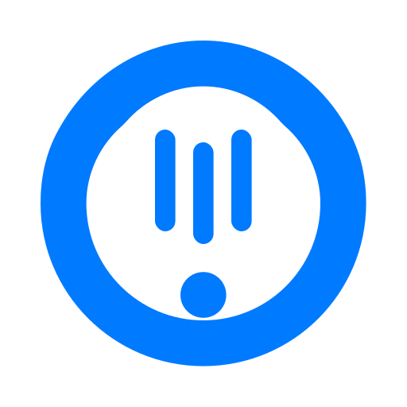

<p align="center">
  
</p>

# ClawKeep

ClawKeep is a macOS companion app and daemon for monitoring `openclaw-gateway`, collecting crash context, and coordinating automated repair flows.

## Overview

ClawKeep consists of a SwiftUI macOS app and a bundled `keepd` daemon. The app handles the menu bar UI and local control surface; `keepd` handles monitoring, log collection, notifications, and agent-triggered remediation.

## Branding

- Source logo: `assets/logo/clawkeep-logo.svg`
- App icon asset catalog: `app/ClawKeep/Assets.xcassets/AppIcon.appiconset`

## GitHub Placement

GitHub repositories do not support a dedicated per-project icon in code. The usual placement is:

- show the logo at the top of `README.md`
- optionally upload the same image in GitHub repository `Settings` -> `General` -> `Social preview`

## Local Build

Build an unsigned app bundle for local testing:

```bash
./scripts/package-local.sh
```

Output:

- app bundle: `build/Build/Products/Debug/ClawKeep.app`
- zip artifact: `dist/ClawKeep-macos-Debug-unsigned.zip`

Build an unsigned Release artifact:

```bash
./scripts/package.sh
```

The app now uses local JSON IPC over a Unix domain socket, so no protobuf/gRPC generation step is required for packaging.

## GitHub Actions

GitHub Actions builds an unsigned macOS Release artifact on every push, pull request, and manual trigger, then uploads:

- `dist/ClawKeep-macos-Release-unsigned.zip`
- `build/Build/Products/Release/ClawKeep.app`

When the pushed ref is a Git tag, the workflow also creates a GitHub Release and attaches the zip artifact.

The CI build now uses the lightweight local IPC version of the app and no longer depends on the Swift gRPC package chain. The Swift client path is `IPCClient.swift`, backed by JSON IPC over a Unix domain socket.
